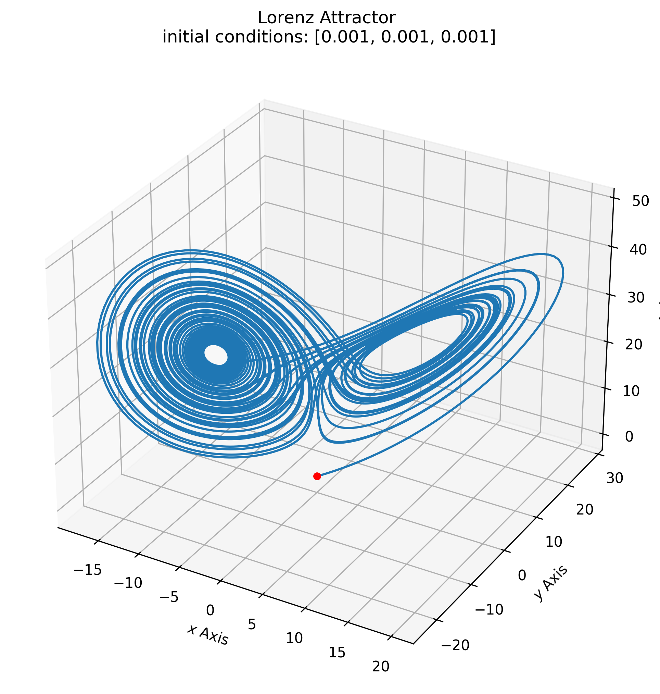

# numerical_methods_for_dynamical_systems
This repo contains different exercises, notes & project regarding dynamical systems. The repo is split into 3 parts: 

### 3 Body Problem
Contains some simulations and qualitative analysis regarding the 3 body problem

  

<i>3D Simulation of the Three Body Problem</i>

This folder also contains an analysis of the Sitnikov problem (*Done as an exercise in the course qualitative and quantitative methods for dynamical systems at Barcelonatech*)

### `NMfDS`: Numerical methods for dynamical systems
This code was made by me as answers to the exercises in the cource at Barcelonatech called "Numerical methods for dynamical systems". This folder contains exercises regarding the reduced three body problem (RTBP), as well as other dynamical systems.  

<i>2D simulation of the logistic map</i>

### `NonLinDyn`: Nonlinear dynamics
This folder contains code i wrote for the NTNU course of the same name. It contains analysis of chaos in both the Lorentz system and the Rossler system.

<i>3D simulation of the Lorentz system</i>

